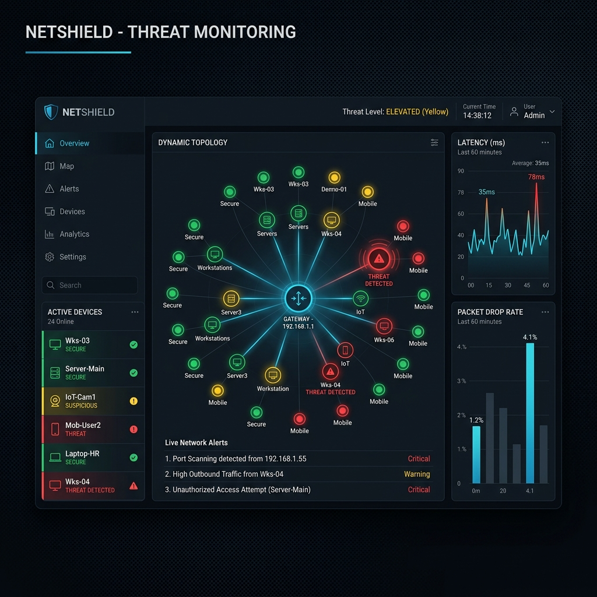
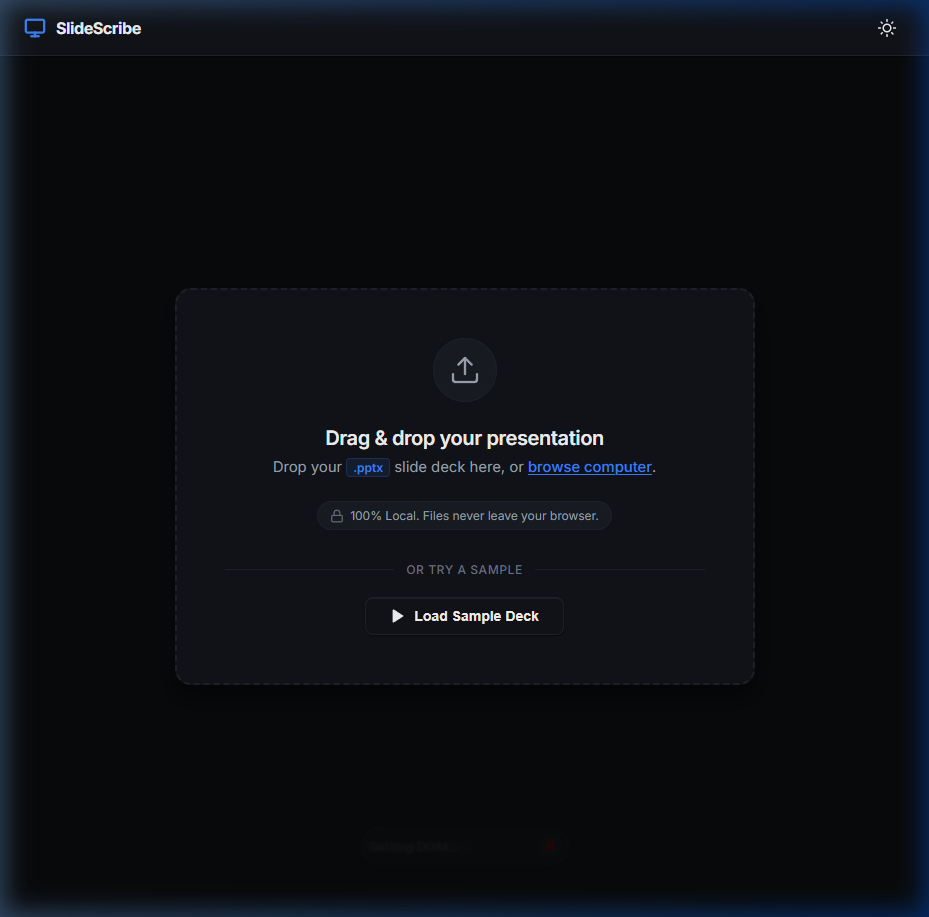
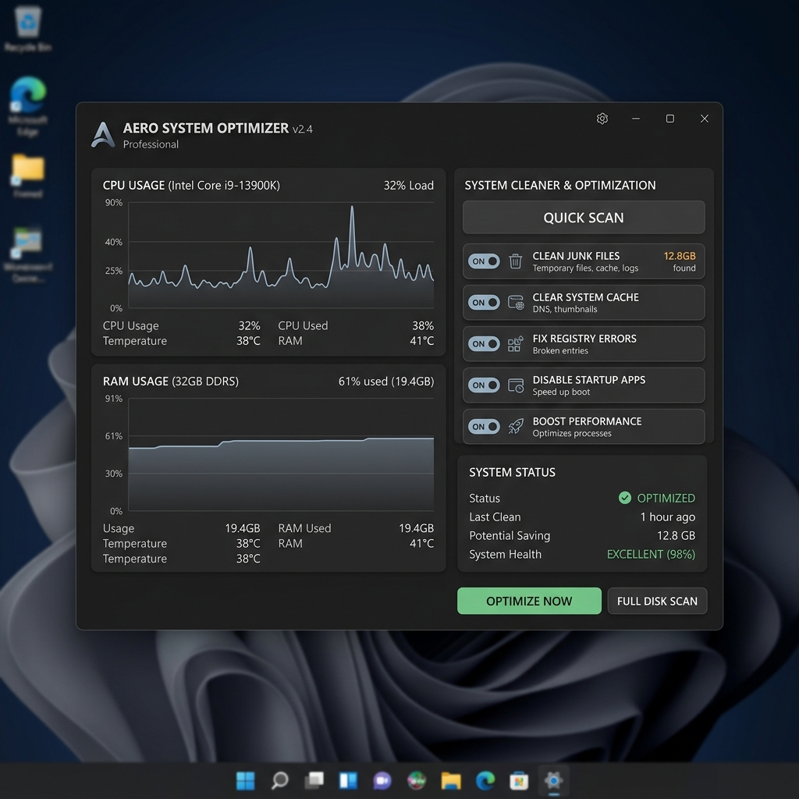

<h1 align="center">
  
</h1>

  
  
  

---

## 👤 About Me
- **Technologies**: I primarily work with Python, Dart/Flutter, Java, JavaScript, and PowerShell, building cross-platform applications and desktop utilities.
- **Currently Learning**: Deepening my knowledge in Backend Architecture, REST/GraphQL APIs, relational & non-relational Databases, Network Security, and Object-Oriented Software Design patterns.
- **Project Interests**: I enjoy creating desktop automation scripts, custom operating system performance utilities, client-side web tools, and network scanning/security dashboards.
- **Networking & Security**: Passionate about network discovery, network packet sniffing, device fingerprinting heuristics, and local network vulnerability assessments.

---

## 🛠️ Tech Stack

### 💻 Languages

### 🎨 Frontend

### ⚙️ Backend

### 📱 Mobile

### 🔧 Tools & Workflow

---

## 📖 Currently Learning
- **Backend Architecture** `[██████░░░░] 60%`
- **API Design (REST & GraphQL)** `[███████░░░] 70%`
- **Databases (SQL & Optimization)** `[███████░░░] 70%`
- **Network Security & Penetration Testing** `[█████░░░░░] 50%`
- **Software Design Patterns** `[██████░░░░] 60%`

---

## 🚀 Featured Projects

### 🛡️ NetSentinel
> **Intelligent local network monitoring, device fingerprinting, and threat analysis dashboard.**

* **Problem Solved**: Standard network scanners are either too complex for regular developers or lack automated fingerprinting and threat assessment. NetSentinel provides real-time topology mapping and security scanning in a single application.
* **Key Features**:
  - Real-Time ARP/ICMP sweeps and passive traffic analysis.
  - Heuristic device fingerprinting (MAC OUI, hostname, open ports).
  - AI-driven background threat scoring.
  - Auto-arranging network topology graph views.
* **Tech Stack**:
  - `Python`
  - `PyQt6`
  - `Scapy`
  - `SQLite3`
* **Status**: 
* **Links**: [💻 Repository](https://github.com/isanthetroller/NetSentinel)

#### 📸 Project Screenshot

  
   
  <em>NetSentinel Dashboard featuring central radial topology, device catalog, and latency monitoring.</em>

---

### 📝 SlideScribe
> **Browser-native, client-side layout viewer and text extractor for PowerPoint presentations.**

* **Problem Solved**: Presentation viewers usually rely on server-side conversions which strip formatting, expose sensitive files to third parties, and require high latency. SlideScribe renders layouts and extracts text completely locally in the browser.
* **Key Features**:
  - Client-side extraction of shapes, text, colors, and layout hierarchies.
  - Offline-capable processing to preserve user privacy.
  - Interactive viewport rendering with light/dark contrast adjustments.
* **Tech Stack**:
  - `Vue 3`
  - `JavaScript (ES6+)`
  - `HTML5 / Canvas`
  - `Vanilla CSS`
* **Status**: 
* **Links**: [💻 Repository](https://github.com/isanthetroller/pptx-viewer)

#### 📸 Project Screenshot

  
   
  <em>SlideScribe interface demonstrating Slide Viewport, shape list, and extracted text inspector.</em>

---

### ⚡ PC Performance Manager
> **Secure, transparent alternative to bloated optimization software.**

* **Problem Solved**: Most Windows system cleaners are closed-source bloatware that install unwanted telemetry or compromise system stability. This project provides a transparent, open-source performance monitoring utility.
* **Key Features**:
  - System memory cleaning and cache purging via secure OS APIs.
  - Hardware utilization tracking (CPU, RAM, Disk).
  - Lightweight background footprints.
* **Tech Stack**:
  - `Python`
  - `Win32 APIs`
* **Status**: 
* **Links**: [💻 Repository](https://github.com/isanthetroller/windows-performance-manager)

#### 📸 Project Mockup

  
   
  <em>PC Performance Manager utility UI showing active hardware monitor graphs.</em>

---

## 📊 GitHub Analytics

<table align="center" border="0" cellpadding="0" cellspacing="0" width="100%">
  <tr>
    <td valign="top" width="50%">
      
    </td>
    <td valign="top" width="50%">
      
    </td>
  </tr>
</table>

  

